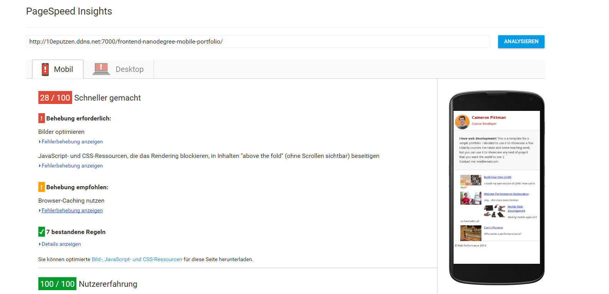

# Website Performance Optimization portfolio project

To run the page, download the zipfile the start it via index.html

## Google Page Speed

###index.html

Adding Cache-control to the Header

```<meta http-equiv="Cache-control" content="public">```
```<meta http-equiv="expires" content="Tue, 01 Jan 2017 1:00:00 GMT">```

Adding media print to the print.css

```  <link href="css/print.css" rel="stylesheet" media="print">```

Inline the style.css and the google font (changed URL)

```<link href="css/style.css" rel="stylesheet">```
```  <link href="https://fonts.googleapis.com/css?family=Open+Sans:400,700" rel="stylesheet">```

Resizing and Optimizing all images

Page Speed before


Page Speed after: 


##Pizza Optimization

###main.js
function changePizzaSizes was completely rewritten

```js
    function changePizzaSizes(size) {
        var newwidth;
        switch (size) {
            case "1":
                newwidth = 25;
            case "2":
                newwidth = 33.3;
            case "3":
                newwidth = 50;
            default:
                console.log("bug in sizeSwitcher");
        }
        //getting the querySelector out of the loop
        var pizzaContainer = document.querySelectorAll(".randomPizzaContainer")
        for (var i = 0; i < pizzaContainer.length; i++) {
            pizzaContainer[i].style.width = newwidth + "%";
        }
    }
```


changing the pizza count to 50

```js
document.addEventListener('DOMContentLoaded', function() {
    var cols = 8;
    var s = 256;
    for (var i = 0; i < 50; i++) {}```

requesting an animation frame for the scrolling

```js
	window.addEventListener('scroll', function () {
	   requestAnimationFrame(updatePositions);
	});
```

Changing the Update Position function

```js
    var items = document.querySelectorAll('.mover');
    var top = (document.body.scrollTop / 1250);

    for (var i = items.length; i--;) {
        var phase = Math.sin(top + (i % 5));
        var left = -items[i].basicLeft + 1000 * phase + 'px';
        items[i].style.transform = "translateX(" + left + ") translateZ(0)";
    }
```